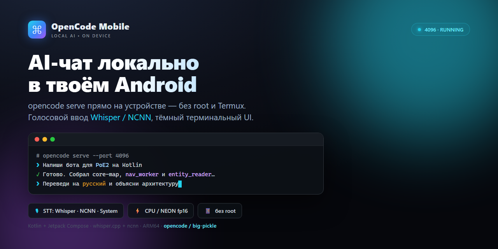

# OpenCode Mobile

<p align="center">
  
</p>

Android-приложение, которое запускает **opencode serve** прямо на устройстве
(без Termux, без root) и даёт полноценный чат с AI-моделью в нативном интерфейсе.

`Kotlin` · `Jetpack Compose` · `WebView` · `whisper.cpp` · `ncnn`

---

## Что это

Обычно opencode работает на десктопе (CLI/TUI) или на сервере. Это приложение
упаковывает сам бинарь opencode внутрь APK и поднимает локальный HTTP-сервер
прямо на телефоне/планшете. Поверх сервера — два слоя UI:

1. **WebView** с веб-интерфейсом opencode (тот же, что в браузере).
2. **Нативный чат-оверлей** поверх WebView — так как официальная SPA не
   рендерит ленту сообщений в окружении WebView, чат реализован нативно:
   приложение опрашивает локальный API opencode каждые 2 секунды и рисует
   переписку сам (Compose).

Итого: «всё в один тап» — открыл приложение, написал сообщение, получил ответ
от модели, которая считается локально на устройстве.

> Это экспериментальный / демонстрационный проект (MVP). Подробности по
> параметрам сборки и известным ограничениям — в конце.

---

## Возможности

### Чат
- Полноценная переписка с моделью в нативном интерфейсе (Compose).
- Поле ввода, оптимистичная отправка, автопрокрутка (с умной остановкой,
  когда пользователь сам листает историю вверх).
- Индикатор «думает» (анимированные полоски) пока модель размышляет.
- Вибрация при завершении ответа.
- Поддержка **вопросов от модели**: если модель спрашивает выбор/уточнение —
  приложение показывает варианты-кнопки и поле для своего ответа.

### Голосовой ввод (STT) — три движка
1. **Системный Android (Google)** — встроенный распознаватель, не требует
   загрузки моделей, нужен доступ к сети.
2. **Whisper (локально)** — whisper.cpp прямо на устройстве, работает офлайн.
3. **NCNN (CPU/NEON fp16 · KV-cache)** — тот же whisper через ncnn, локально,
   оптимизирован под CPU и KV-cache.

Движок выбирается в настройках (шестерёнка в шапке чата).

### Модель STT
- **base (141 МБ)** — скачивается по требованию при первом выборе (lazy, как turbo).
- **large-v3-turbo (574 МБ)** — точнее на быстрой речи; скачивается по
  требованию из панели настроек (с прогрессом и докачкой при разрыве).

### Настройки чата
- **Шрифт ответов модели** — 20+ встроенных шрифтов (тап по образцу — сразу
  применяется и сохраняется; кнопка — иконка шрифта).
- **Цвет ответов модели** — градиент-пикер (тап/драг по квадрату; кнопка —
  иконка-капля, тонируется текущим цветом ответов).
- **Диагностика STT** — «TTS-тест»: синтезирует фразу системным TTS и гонит её
  через выбранный движок распознавания. Позволяет понять — проблема в модели/пайплайне
  или в микрофоне (результат в logcat по тегу `VOICE`).

### Сервер
- Foreground-сервис держит процесс opencode serve, рестартует его с backoff
  при падении, проверяет доступность по HTTP.
- Рабочая директория (workspace) создаётся на устройстве, сессии живут там.
- Уведомление с кнопкой «Stop» и статусом процесса.

---

## Техническое устройство (как это работает)

### Запуск opencode на Android без root

Android-ядро позволяет `execve` только с **PIE**-бинарём, и только из
`nativeLibraryDir` для `untrusted_app`. Поэтому:

| Файл (`app/src/main/jniLibs/arm64-v8a/`) | Роль |
|---|---|
| `libopencode.so` | Бинарь opencode (musl-сборка, переименован в `lib*.so`) |
| `libldmusl.so` | musl-лоадер (это `ld-musl-aarch64.so.1`, он же libc) |
| `libc_musl.so`, `libstdcxx.so`, `libgcc_s.so` | musl-libs под placeholder-именами |

Ключевые моменты:

1. **`useLegacyPackaging = true`** в `app/build.gradle.kts` — заставляет
   `extractNativeLibs=true`. Без этого `.so` не извлекаются на диск (маппятся из
   APK для dlopen) и `execve` невозможен.
2. Бинарь — **динамический musl**: в нём `PT_INTERP=/lib/ld-musl-aarch64.so.1`,
   которого в системе нет. Поэтому лоадер запускается первым аргументом:
   `ld-musl ./libopencode.so serve --port 4096`.
3. **Имена `lib*.so`** — PackageManager извлекает только такие файлы; при старте
   зависимые либы копируются в `filesDir/musl` с правильными DT_NEEDED-именами,
   на них указывает `LD_LIBRARY_PATH`.

### STT на CPU

На ColorOS/OPPO фоновые compute-потоки душатся до 1–5% CPU. Поэтому
распознавание выполняется в **foreground-сервисе** (`WhisperTranscribeService`) —
так ОС даёт процессу нормальный приоритет. Модель кэшируется в память между
вызовами (грузится один раз), что критично для тяжёлого turbo (574 МБ).

Запись: `AudioRecord` → PCM16 16кГц → нормализация пика (телефоны пишут тихо) →
подкладка тишины (whisper врёт на очень коротких клипах) → распознавание →
текст в поле ввода.

---

## Сборка

### Требования
- **Android Studio** (или Android SDK + JDK 17) с SDK Platform 36.
- ARM64-устройство (физический телефон) или arm64-эмулятор.
- Файл `local.properties` с путём к SDK (не коммитится в git).

### Шаги
1. Открыть папку проекта в Android Studio, дождаться синка Gradle.
2. Собрать: `Build → Build APK(s)` или из терминала:
   ```bash
   ./gradlew :app:assembleDebug
   ```
3. APK появится в `app/build/outputs/apk/debug/app-debug.apk`.
4. Установить:
   ```bash
   adb install -r app/build/outputs/apk/debug/app-debug.apk
   ```
   или просто скопировать APK на телефон и открыть.

### Про бинари (важно)

Сам бинарь `opencode` (**~185 МБ**) и модели **НЕ лежат в git** — они слишком
большие (лимит GitHub — 100 МБ на файл). В репозитории — только исходники.
Чтобы собрать рабочий APK, нужно положить бинари на место:

- `app/src/main/jniLibs/arm64-v8a/libopencode.so` — бинарь
  `opencode-linux-arm64-musl` (переименовать в `libopencode.so`).
- Остальные `libldmusl.so`, `libc_musl.so`, `libstdcxx.so`, `libgcc_s.so` —
  musl-библиотеки (см. раздел выше).
- `app/src/main/assets/mcp/memory.js` — MCP-память.
  whisper модели (**base**, **turbo**) в assets **не хранятся** — качаются по
  требованию через `ModelDownloader` в `filesDir/models/`.

Бинарь и модели можно получить пересборкой/скачиванием; в текущем состоянии
этот процесс не автоматизирован в репозитории (кроме самих моделей — они
скачиваются прямо в приложении).

---

## Установка готового APK

Установка:

- **Debug**:
  ```bash
  adb install -r app/build/outputs/apk/debug/app-debug.apk
  adb shell monkey -p org.opencode.mobile.debug -c android.intent.category.LAUNCHER 1
  ```
- **Release** (R8-минифицирован, подписан debug-ключом для локального теста):
  ```bash
  gradlew.bat :app:assembleRelease -x lint
  adb install -r app/build/outputs/apk/release/app-release.apk
  adb shell monkey -p org.opencode.mobile -c android.intent.category.LAUNCHER 1
  ```

Логи смотреть:
```bash
adb logcat -s OpencodeRuntime OpencodeServerService OpencodeWebView VOICE
```

---

## Структура проекта

```
app/
  src/main/
    java/org/opencode/mobile/
      MainActivity.kt            # точка входа, WebView, статус сервера
      OpencodeApp.kt             # глобальный конфиг каталогов (sandbox)
      server/
        OpencodeServerService.kt # foreground-сервис: жизненный цикл opencode serve
        OpencodeRuntime.kt       # запуск musl-лоадером
        Ipv4Proxy.kt             # вспомогательный (исходящая сеть)
      stt/
        WhisperTranscribeService.kt  # foreground-сервис распознавания
        ModelDownloader.kt           # скачивание whisper base/turbo (lazy, resume)
      ui/
        ChatOverlay.kt           # нативный чат поверх WebView + настройки
        theme/Theme.kt
    assets/                       # ТОЛЬКО шрифты + MCP-память (моделей нет)
    jniLibs/arm64-v8a/           # opencode-бинарь + musl-libs (не в git)
whisperlib/                      # JNI-обёртки над whisper.cpp и ncnn
  src/main/jni/
    whisper/                     # whisper.cpp (CMake, CPU)
    ncnn/                        # ncnn-whisper (CPU/NEON, KV-cache)
tools/
  connect_proxy.py               # помощник по исходящей сети
  ncnn-whisper-plan.md           # план интеграции ncnn-whisper
  ncnn-int8-plan.md              # план int8-квантования ncnn-encoder
```

---

## 🚀 Оптимизации и история изменений

Актуальные работы по производительности UI/рендера (подробно — [CHANGELOG.md](./CHANGELOG.md)):

| # | Что сделали | Результат |
|---|-------------|-----------|
| 1 | Инкрементный парсинг ленты + адаптивный поллинг (400/900 мс) | Парсинг ушёл (58 cached / 0 parsed) |
| 2 | Приостановка фонового WebView (SPA) | Frame-спайки: 99-перц. 21→9 мс, janky 6.87→0.33% |
| 3 | Убраны вечные анимации индикаторов | UI CPU 33→2%, RenderThread 10→0% |
| 4 | Пауза поллинга и анимаций, когда Activity в фоне | Фоновый CPU ~0% |
| 5 | Эффективное мигание MCP (дискретный пульс вместо 60fps) | Мигание возвращено, CPU ~8% (фон 0%) |
| 6 | Все UI-кнопки на готовых Material-иконках (extended) | Микрофон, отправка, stop, шестерёнка, шрифт, цвет — векторные, читаемые |
| 7 | R8-минификация + shrinkResources в release | APK 374 → 274 MB (R8), затем lazy-вынос base → **147 MB** (debug подпись для локального smoke; пакет чистый `org.opencode.mobile`) |
| 8 | base-модель вынесена из assets в lazy-скачивание | base/turbo качаются по требованию; APK больше не тащит 141MB whisper |

**Итог:** UI CPU ~38% → ~1.5-8% (×5–25), рендер 99-перц. 9 мс, janky 0.33%,
фон ~0%. Единственный хвост — внутренний `opencode serve` (~35%, код движка, не наш).

---

## 🗺 Дорожная карта

План по доведению клиента до «продукта для чужих телефонов» (release-контур,
сеть без ручного прокси, STT turbo на CPU) — см. [docs/ROADMAP.md](./docs/ROADMAP.md).

---

## Тонкости / известные ограничения (MVP)

- **DNS / исходящая сеть**: на Android нет `/etc/resolv.conf`; musl шлёт запросы
  на `127.0.0.1:53`, недоступный приложению. Для сети наружу нужен локальный
  HTTP-прокси с env `HTTPS_PROXY`. Пока сервер работает локально (WebView/чат) —
  это не критично, но подключение к внешним сервисам без прокси не работает.
- **Сабпроцессы opencode** (`rg`, `git`, языковые серверы) на устройстве
  отсутствуют — часть фич (`/find`, git-интеграция) не работает.
- **ForegroundServiceType `specialUse`**: сервера и STT используют `specialUse`
  (+ `PROPERTY_SPECIAL_USE_FGS_SUBTYPE`). Для side-loaded MVP допустимо; для
  публикации в Play требуется прохождение ревью этого типа.
- **SELinux**: маппинг либ из `filesDir` (`mmap PROT_EXEC`) может быть ограничен
  политикой `untrusted_app` — проверено на реальном OPPO, на других устройствах
  стоит делать smoke-тест.
- **Performance STT**: тяжёлый turbo на CPU считается долго. Многопоточность и
  int8-квантование ncnn-энкодера — в планах (см. `tools/ncnn-int8-plan.md`).

---

## Лицензия и статус

Экспериментальный личный проект. API и внутренности могут меняться. Не является
официальным продуктом opencode.
